# FlashMail

The goal of this report is to help future Computer Science in the Students Writings course to understand the parts of the project we have started building and to help them complete the development and maintenance of this project. 


# Introduction

### The problem
As Students at Cphbusiness, we experienced some difficulties and disorder in the forms that the school uses to deliver important informations to us. Students are expecting to receive information over private e-mail, SMS or the schools multi-intranet websites (2-3 different forums). Each teacher prefer a different form of communication platform, and the emails/SMS that the students receive usually gets lost between private messages. This makes it harder for the students to come back and find the information the school sends. 

### The solution - single source of information:
 
#### The idea
As a suggestion for a solution for to this practical problem, we came out with the following idea. We want to build a platform that makes it easier for both the teachers and the students to have this one-way communication, where the students can access all information sent by the school by checking **only one place**.  At the same time the teachers is only expected to send the information through one platform that will assure that the information is delivered to the students despite if they are using the platform or not.

#### The platform
We want to realise this idea by building a platform that consists of two interfaces: 

**1)	An app for the student**
An app that assembles all information sent by the school in one place. All messages sent by the school is collected in the app, where the student at any time can come back and check the messages. The student will be able to see the messages, who sent the them and in which course the messages belongs.
**2)	A web interface for the teacher**
We want to build a web-application where the teachers can manage the platform. The goal is to give the teachers the tools to send messages, create new classes and edit/delete exiting student/classes. 

<!-- SART DESIGN & Arch-->

# Design & architecture 	

## General
Let’s take a look at some UML-diagrams to help understand the design and architecture behind the system we have built. 
The system is expected to have two types of end-users. A **student** that uses an **app-client** to receive messages. And a **teacher** that uses a **Web-application** to manage teams and messages. 
The Use Case Diagram underneath shows the actions the two types of users can take in the current version of the system.  
Because the system can dynamically evolve in the directions that future developers choose, we’re only going to cover the use cases of the current version of the system.

 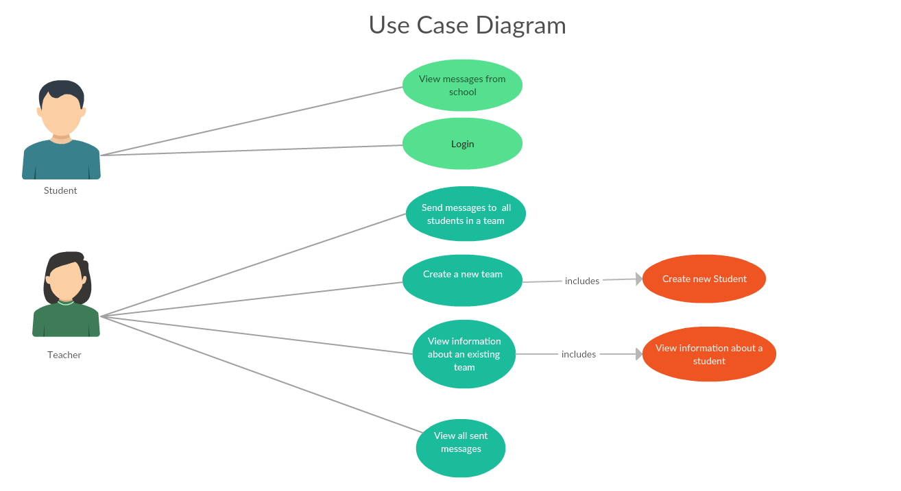
Above we see a Use Case Diagram that show the actions that the end-users. 


## The system architecture and deployment
The system is built in a three-layer architecture; A presentation-, business- and data tier. In the presentation tier we have the phone-client and the web application client. In the business tier we have a node-server (ExpressJS) that receives calls from the clients in the presentation tier through a REST-API and makes the relevant data manipulation and business. The on top of the node-server we want to build a mail-server that sends emails to students who don’t have the app-client. We have built a facade that contains all the database manipulation methods needed in the business tier. We have initialized the mongoose-framework ind the DatabaseFacde. MongooseJS is a framework that improves the ease of data-manipulation and the database document design . 
In the data tier we have our document database, MongoDB, where all the system data is saved. Too avoid confusion, I have drawn a simplified deployment diagram.
To secure high availability and consistent,  I recommend using load balancer in front of both the node-server and replication in MongoDB. 
 

 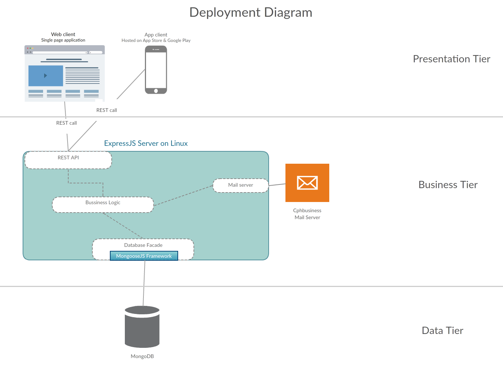
 
### Database documents
As mentioned earlier we’re using a document database with the MogooseJs framework to design and build the document. The database will consist of three types of documents; A Team, a Student and a Teacher document. Each Team will have an unique id, a name, a list of message-objects that have references to the, sender, Teachers document, and a list of references to student documents that is in the Team. The Teacher documents will have an unique id, name, mail and an URL to a personal image. The Student document contains all the attributes in the Teachers document and furthermore a token that is used to send notification trough the phone-app, and a list of the teams that the student is member of. 
#### Index-reverse searching
 We gain a several benefits by saving the Student information in a separate document. One of them is the possibility of index-reverse searching, when we want to get all messages belonging to a given student. To do that we only need to find the given student document, and get the messages of the teams that have reference in the “teams”-list inside the Student document. That will make the system more efficient and reduces the load on the database server.
 
 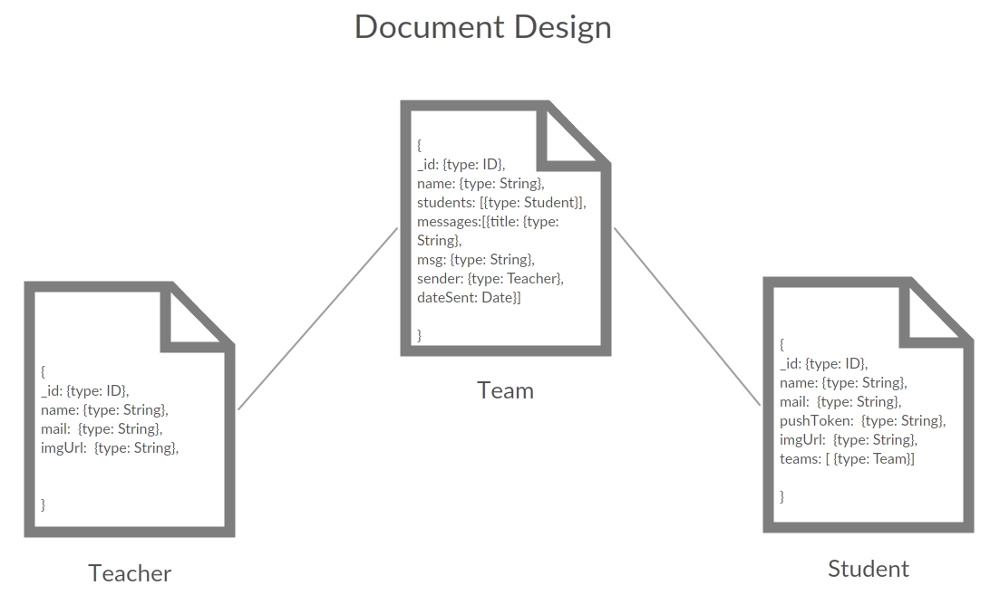


## Designing the presentation layers 
As mentioned earlier we do have two clients that communicate with the backend. The phone-client is built with React Native and the web-client is built with ReactJS. The fact that both ReactJS and React Native use the similar component based approach makes the switching between the two development environments as a full-stack developer more efficient.


### Phone client – for the students
I have chosen to build the phone-client with the powerful React Native framework. The navigation diagram underneath helps understand the component design of the system.  The app is divided in Screens and components. 
Currently I have Login, Home and Profile screens. The login Screen contains an embedded component that contains the logic and design needed to identify the user and to navigate to the Home-screen if the identification is succeeded positively. 
Screens can be looked at as containers for smaller components. They should not contain any logic or static design, but only components. 

The navigation diagram beneath will help you understand the component design of the phone-client. 
 
 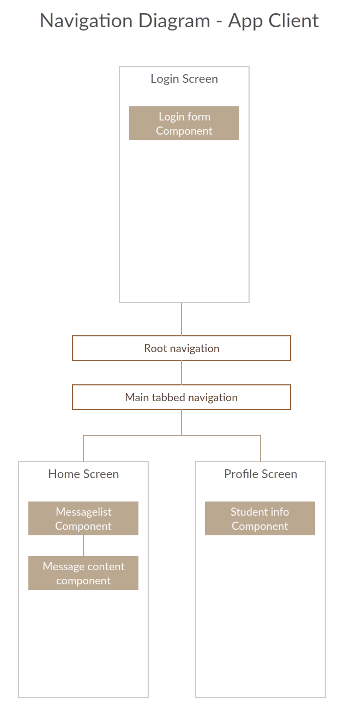

There is basically two navigation components; A root navigation and a main tabbed navigation. The root-navigation navigates between the login screen and the main tabbed-navigation. Only If the user is identified, he will be navigated and to the main tabbed navigation. The main tabbed navigations function is to route the user between the screens that are available for logged in users.


### Web client – for the teacher
As mentioned before, I have chosen ReactJS as a framework to build the web-application client for the teacher to manage the system.  The application was planned to have a login-screen to identify the current logged in teacher, in the enter page of the application. But due to the short time I got, I have chosen to concentrate on other essential features instead. More about this in the Future Development section.
The curren version of the app have a navigation component that connects four different sub-pages. 
1)	A page to create a new team
2)	A page to manage exiting team
3)	A page to send new messages to existing teams
4)	A page to see a list of all sent messages to a chosen team

The Navigation diagram beneath explains the design of the front-end application.
 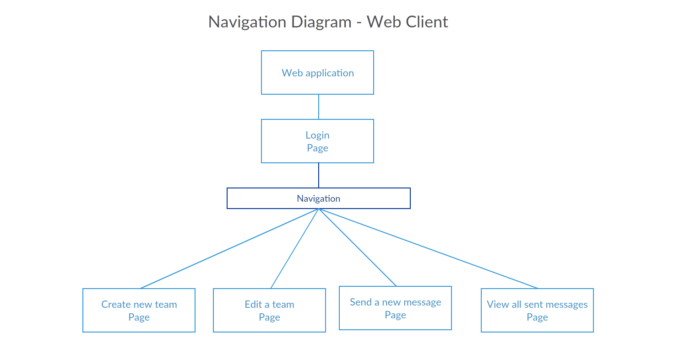


# Future development 
## Setting up the development environment
In the following I will explain how to set up the development environment for future development. 

### Backend
#### Setting up MongoDB
Firstly we’re going to set up the backend with the database-server and the node-server so we have the REST-API ready for the client-projects.

First step is to install the MongoDB Community Edition either on your local machine or in a remote machine.  
Following guides will help you set-up the MongoDB server. 

[Install MongoDB on Linux](https://docs.mongodb.com/manual/administration/install-on-linux/)

[Install MongoDB on macOS](https://docs.mongodb.com/manual/tutorial/install-mongodb-on-os-x/)

[Install MongoDB on Windows](https://docs.mongodb.com/manual/tutorial/install-mongodb-on-windows/)

Once we have MongoDB up and running, we gonna create a new database called “flashmailDB” (or whatever name you choose.). In the mongo shell type:
```
use flashmailDB
```
Now that we have created a database we want to create a user that have read and write permission to that database. Make sure that you have switched to the newly created database and type the following to create a new user: 
```
db.createUser({user: "readWriteUser", pwd: "carlsbergsport500ml", roles:[{role: "readWrite", db: "flashmailDB"}]
```

Now that we have a database ready and a user with read and write permission, we can go and clone the server-project so we can connect the node-server to the database that we just created.

#### Setting up the node-server
To setup the server you need to:
1) clone the project on your development machine and install the node packages
2) tell Mongoose to use the database that we created before

Firstly lets go ahead and clone this repository and navigate to the FlashMailServer folder. Here we have the whole server-project. Open terminal(macOS/Linux) or GitBash on Windows inside the FlashMailServer folder and run npm install or yarn to install the packages used by the project. If you don’t have npm or yarn installed on your machine, go ahead and install them.
```
npm install
```

It takes usually some time to install the packages so be patient.

Once the npm/yarn has finished installing the packages go ahead and open the project with your favourite IDE.  I personally recommend you to use [Visual Studio Code](https://code.visualstudio.com), but it’s totally up to you what to use.

Now that we have installed the node packages we are only one step from finishing the server set up; Telling mongoose where the location of our MongoDB server.  Open FlashMailServer -> data -> DatabaseFacade.js 
In line 10 replace the connection string URI inside the connect method with one that points at the database that you we have created earlier. You can read more about the connection URI [here](https://docs.mongodb.com/manual/reference/connection-string/) 
 

>Note that it is unsecure to keep the connection URI inside your code, since it contains critical credentials to your database. You should instead store your credentials in Vault.js (or similar tool) and when the app starts, make a call to it and get the credentials. But since we still are in development face, we can let that connection URI be where it is.

Once you have replaced the connection URI open the terminal/Git Bash again and run the following command:
```
npm run devstart
```

This will start the server on localhost:4000 . Go ahead and type http://localhost:4000/ on your browser. 
If you see the following message, then you are good to go. Congrats you have set up the backend to serve the frontends!
  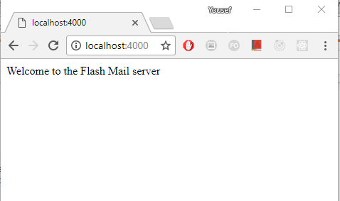


One last step before we move on to the front end
Before we start setting up the frontend, we are going to create two teacher to the database, so we have something to work on when we move to the frontend.
1)	Open FlashMailServer -> data -> DatabaseFacade.js 
2)	Uncomment line 18 and run the server(you should see “Kasper created” and “Lars created” in the console)
3)	Comment line 18 again
4)	Done!

Now we have saved two new Teacher objects in the database and we good to go to move to set up the clients.

### Frontend
#### Setting up the web client.
Now that we have a our server running we can start the web-client. To do that, and presuming that you have cloned the full repository, we need to
1) install the node packages
2) Make sure that our web-application have the correct REST-API URL.

Firstly lets go ahead and clone this repository and navigate to the FlashMailWebApp folder. Here we have the whole web-project. Open terminal(macOS/Linux) or GitBash on Windows inside the FlashMailWebApp folder and run npm install or yarn to install the packages used by the project. 

Once the package manager finishes installing the packages needed, go ahead and open FlashMailWebApp->src->data->DataStore.js
This file contains all the REST-Call functions we are going to use in our application. In line 6 we define the URL to the server that hosts the REST-API. Make sure that it points to your server.( http://localhost:4000 if you’ve followed the previous step)

 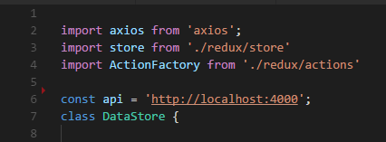
 
 
Now open the terminal again and run following command:
```
npm start
```
Done! Now the web application runs on http://localhost:3000
Go ahead and type that on your browser. Feel free to explorer the system, send some messages and create a new team. 


#### Setting up the phone-client.
Presuming that you already have cloned the project and set up the server, we now are two steps from running our phone-client:
1)	As done in previous set ups, we need to install the node packages
2)	We need to install Expo and set it to serve it so we can open it on a phone or emulator 

Go ahead an open an terminal/Git Bash window inside the FlashMailPhoneClient folder and run npm install or yarn to install the packages used by the project.
```
npm install
```
Once you have installed the packages go ahead and open FlashMailPhoneClient->data-> RequestHandler.js , find line 5 and make sure that the ReequestHandler points at your server.
  
 

 

To run the application on a phone or in a emulator we need a Packager that serves the files to the phone OS. Since we've created the project using Expo we also are going to use the Expo packager to run the app on the phone/emulator. Go ahead and download Expo XDE on your local machine from [here](https://expo.io). Once you have installed Expo XDE on your computer, go ahead and open the phone-client project with expo (the folder FlashMailPhoneClient) 

You should see the following message:
 
 


Finally you need to install the Expo-client on either a physical phone or in a simulator. Go ahead and install it from the App Store or Google Play and scan the barcode from the Expo XDE in your computer.

The project will now load in your physical phone/emulator.  

**Congratulations!** You have now set up the whole system and you can freely go ahead and explorer the implemented features! 

### Explaining the redux implementation

To manage the state of the UI-components in the web interface(the teachers interface), I have chosen Redux as state management framework. 
 
 
 
 Redux data flow

In the FlashMailWebClient->src->data->redux folder we have three scripts; actions.js, reducer.js and store.js. 
In the stoje.js, we import createStore from the redux package and use it to create a new store that we make available to other components by exporting it as default.
 
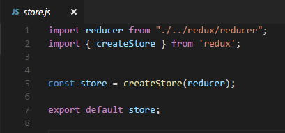


In reducer.js we’ve defined all the reducer functions that updates the store
   
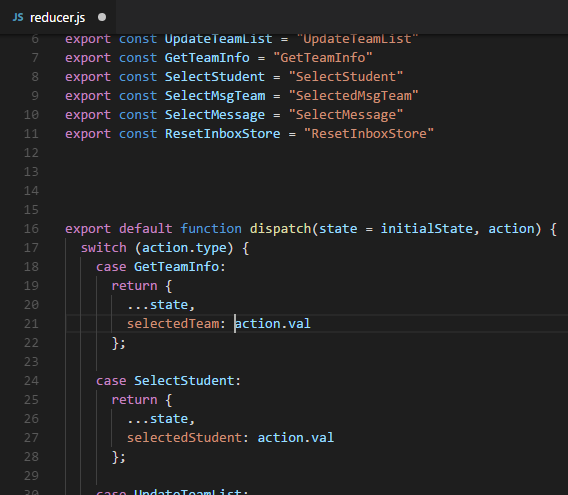


While in action.js we have defined the actions that we give as parameters to the dispatch method. 
  
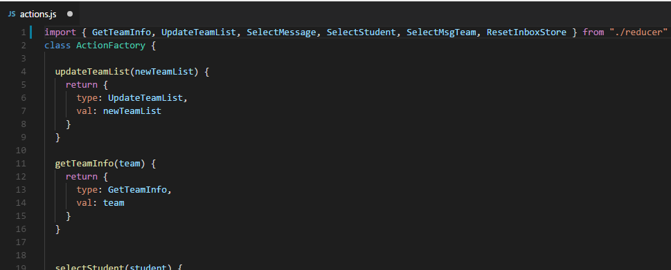


There are serval ways to make the redux store available in the React components. I’ve chosen to use the wrapping approach, by using the Provider component and connect function. Indside index.js we import Provider from the react-redux package, and wrap our entire router component with it. Then we can set the our redux store that we have explained earlier, as a prop in the provider component. This will let us make the store available in any component indside the router; hence any component inside our app.   
 
 
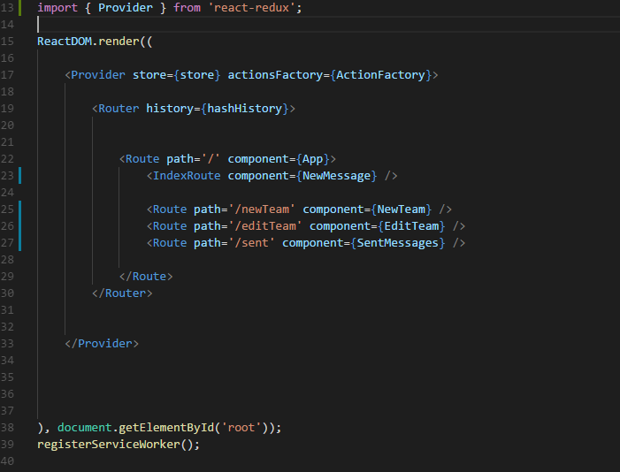

Remember though to call the connect method, that we import from redux-react, when exporting the React component.
   
   
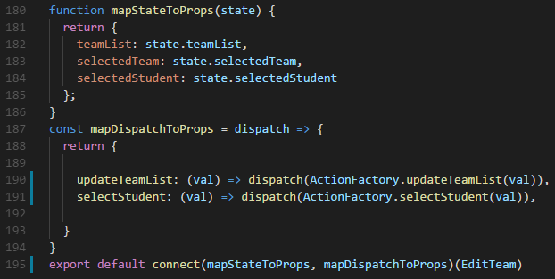

## API documentation
The table beneath shows an overview of the current REST-API
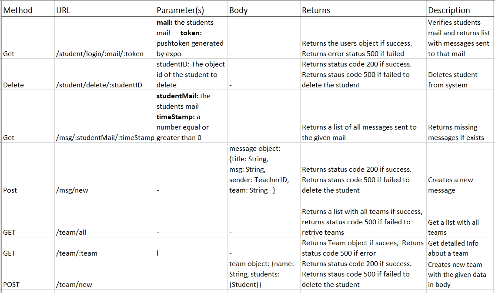

<!-- Section finished -->
## Current status on product
This project is only partly done, and as stated in the introduction, this project was initiated to be a start point for future students in Cphbusiness to take up and continue developing. 
Beneath is a list of all completed features: 


### Features in the web client		

| Feature  |  Description |  Status |
| ------------- | ------------- | ------------- |
| Create new team   | Teacher can send messages to existing teams   | :white_check_mark: |
| Remove a student  | Teacher can create a new team by gving the team a unique name and pasting a list of student in the standard format used by Cphbusiness    | :white_check_mark:|
| See team details   |  Teacher can see complete details of a given team  | :white_check_mark: |
| See student details   |  Teacher can see complete details of a given student  | :white_check_mark: |
| Login   |  Login to the system  | :x: |
| Delete teams   |  Teacher can delete a teams  | :x:  |
| Send email    |  Send email to students that dosen't have an app.  | :white_circle: | 

### Features in the phone client		


| Feature  |  Description |  Status |
| ------------- | ------------- | ------------- |
| Push notifications   | Students receive a push notification from the Flash Mail app, when a new message is sent to them  | :white_check_mark: |
| See messages   | Student can see a list of all messages sent to the teams he/she is a member of  | :white_check_mark: |
| Profile details   | Student can see all his/her profile details   | :white_check_mark: |
| Login   | Student can login to the system using the schools mail  | :white_check_mark: |
| Timestamp | Timestamp system where not all messages are fetched every time user opens the phone(partly done)  | :white_circle: |
| Calender | Show the students calender in the app  | :x: |


